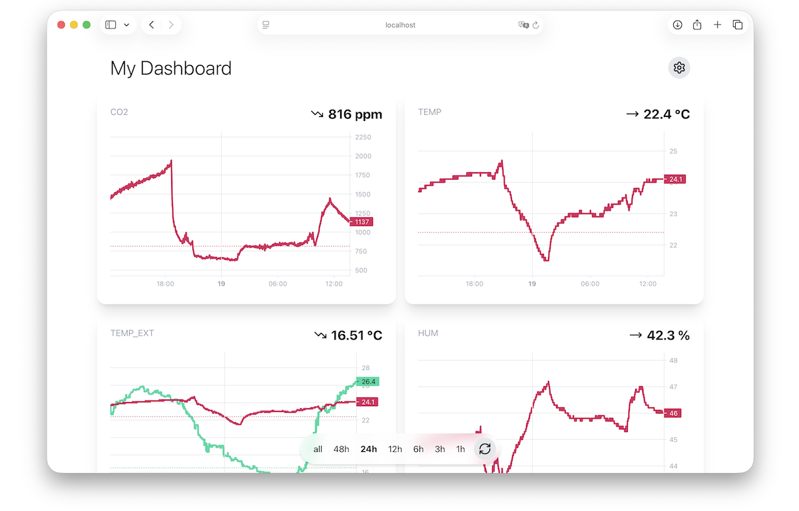

# My Dashboard

A simple dashboard for monitoring sensor data from JWT secured endpoints. Built with [Next.js](https://github.com/vercel/next.js) and [lightweight-chart](https://github.com/tradingview/lightweight-charts).



## Installation/Development

```
pnpm install
pnpm dev
```

## Configuration

Create a new `.env` file from the default configuration:

```sh
cp .env.default .env
```

There you can set your API endpoint and Auth0 credentials (see Authorization section below):

```
NEXT_PUBLIC_DATA_API=https://your-data-api.com
NEXT_PUBLIC_AUTH0_DOMAIN=your-auth0-domain.eu.auth0.com
NEXT_PUBLIC_AUTH0_CLIENT_ID=your-auth0-client-id
```

## Expected Data

Your API endpoint is supposed to send JSON data in the following form:

```json
[
  {
    "ts": 1754704317427,
    "temp": 23.7,
    "co2": 928,
    "hum": 48.4,
    "temp_ext": 16.42
  }
]
```

Other data keys can be configured in [src/lib/constants.ts](src/lib/constants.ts).

## Authorization

This dashboard currently supports [Auth0](https://auth0.com/) as an authorization provider. How to setup and configure your Auth0 account is explained in this [tutorial](https://auth0.com/docs/quickstart/spa/react/interactive).

With everything properly configured, the API request will be signed with a JWT token that can be used then for validation in your backend.
